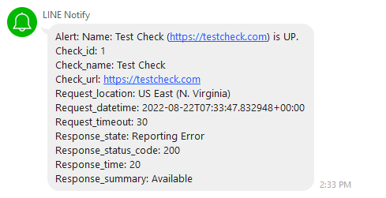

# golang-line-gw
#for freshing integrations line-gateway
```
{
  "text": "{text}",
  "check_id": "{check_id}",
  "check_name": "{check_name}",
  "check_url": "{check_url}",
  "request_location": "{request_location}",
  "request_datetime": "{request_datetime}",
  "request_timeout": "{request_timeout}",
  "response_state": "{response_state}",
  "response_status_code": "{response_status_code}",
  "response_time": "{response_time}",
  "response_summary": "{response_summary}"
}
```

#example


